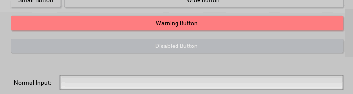

# General Info
Snu Kivy Template is a collection of classes and widgets that make it easier to create theme-able, clean, and a bit flashy apps in Kivy.  Please note that this depends entirely on Kivy, and will not be usable without Kivy installed first.  

This is a gift to the Kivy community, a culmination of what I have learned over the years when developing several kivy-based apps.  Use these classes as a basis for your own, or just use them directly, I impose no limitations on the code or images enclosed in this archive.

To use this template, copy the 'snu' folder to your app directory, and start importing stuff.  See the main.py and test.kv files for examples on how to use the various widgets.  

These widgets mostly depend on the 'NormalApp' class found in 'snu.app.NormalApp'. To use the various widgets, you must make your app a subclass of this, not the basic kivy App class.

Here is a demo of some of the features implemented:
  

# snu.app.NormalApp Functionality

This class is a subclass of the 'kivy.app.App' class.  Please note that to set the following variables to custom values, you can pass them in when creating and running your app like this: 

    MyApp(theme_index=1).run()

This class also implements the following extra features:

## Themes
Two default themes are included in the 'themes' variable, this is simply a list of dictionaries with a specific set of keys.  Copy one of the theme variables and modify the color values to create your own.  

#### NormalApp.button_scale
Numeric Property, this controls the overall scale of interface, sane values should be between 50 and 150.  
This value is loaded from the app config file, 'buttonscale'.  
When the config is changed, or when this value is changed, the app will automatically adjust scale.

#### NormalApp.text_scale
Relative scaling of text, sane values are between 50 and 150.  
This value is loaded from the app config file, 'textscale'.  
When the config is changed, or when this value is changed, the app will automatically adjust scale.

#### NormalApp.scaling_mode
Option Property, this must be set to either 'divisions' or 'pixels'.  This determines how the interface will be scaled for all included widgets.  See 'NormalApp.scale_amount' for more information on each option.  

#### NormalApp.scale_amount
Numeric Property.  How this is interpreted will vary depending on how the 'scaling_mode' is set.  This acts as a multiplier for the button_scale variable.  Defaults to 15.  
* If scaling_mode is set to 'divisions', this will define the number of buttons that will be vertically visible in the window at a button scale of 100%.  
* If scaling_mode is set to 'pixels', this variable will set the height of the standard button in pixels.  

A good way to make the interface scale well to different screen sizes is to use pixel scaling mode, and set the value using a function from kivy.metrics, like so:  

    from kivy.metrics import cm
    MyApp(scaling_mode='pixels', scale_amount=cm(1)).run()

#### NormalApp.theme_index
Numeric Property, this defines the index of the theme from the 'themes' variable to be loaded on app creation.  Override this variable in your app to set a different theme index to start with.  

#### NormalApp.load_theme(Integer)
Load a specific theme index from the themes variable.  This will cause the theme to 'fade' from the current theme.

Tip: Try creating a fully black or fully white theme as the default, then loading your default theme in your on_start for a nice fade-in!

#### NormalApp.data_to_theme(Dictionary)
Load a theme dictionary as the theme for this app.  Note that if any variables are missing from the dictionary, the current variables will not be changed.  

 

## Other App Features

#### NormalApp.popup_x
Numeric property that sets the default width in pixels of auto-generated popups. Defaults to 640.

#### NormalApp.animations
Boolean Property, defaults to True.  Setting this to False will disable all animations in the custom widgets.

#### NormalApp.animation_length
Numeric Property, defaults to 0.2.  This will define the length of the animations in all custom widgets.

#### NormalApp.clickfade(Widget, mode='opacity')
This function will create a quick colored overlay in the shape and size of the passed-in widget.  This can be used to bring the user's attention to an important widget, or to show that something has been clicked on.  
The 'mode' argument can be set to 'height' to cause the clickfade to fade out by shrinking in height instead of fading out (default behavior).

#### NormalApp.message(String, timeout=20)
This function will create a user feedback message that will automatically be displayed by all snu.label.InfoLabel widgets.  
This message will blink for a few seconds then vanish.  
Pass in a Float to the timeout variable to change the time this text is displayed.  

#### NormalApp.clear_message()
This function will instantly clear the app message shown in the InfoLabel widgets.

#### NormalApp.about()
This function will open a popup that shows the about this app message.  

#### NormalApp.about_text
String Property, this is the text that will be shown in the popup generated by the about() function shown above.  

#### NormalApp.message_popup(String, title='Notification')
This function will open a simple message popup that displays the passed in String along with a basic 'OK' button.

#### NormalApp.set_window_size(load=True)
The NormalApp class will store current window size and position in the config file.  This function can be used to apply the stored window size.  The 'load' argument is a boolean and when set to True will cause the function to first load the stored window size from the config file.  
This can be used in the on_start function to recall the last saved window size:  

    def on_start(self):
        self.set_window_size()

 

## Keyboard Navigation
Keyboard and joystick/gamepad navigation is implemented through some functions in the NormalApp class, and the snu.navigation.Navigation class.  To use this functionality, you must first activate it in your app's on_start() function, then you must use classes that utilize the Navigation class as a mixin.  Relevant classes in this template include this mixin already (all buttons, all text inputs, slider, smoothsetting and filebrowser list items).  

To activate navigation in your app, you must do two things:
* Call one of the built-in start functions to activate it  
* Use widgets that mix in the snu.navigation.Navigation class  

To navigate between selected items, press the down or up arrow keys (or joystick down or up, or down or up on a gamepad dpad).  When an item is selected, it will be highlighted by adding a colored square to the canvas.after commands.  

When a widget is selected, press enter, or the first button on the joystick/gamepad to activate the widget (for buttons this will press it, for text inputs this will focus it).  

For widgets that can be adjusted with different values such as sliders or smoothsetting widgets, pressing the left/right arrow keys, or left/right on the joystick or gamepad dpad will cause this widget to raise or lower its variable.  

For recycleviews with a lot of elements, it can be benefitial to jump out of the list, press the tab key to immediately jump to the next selectable widget out of the recycleview.  

#### NormalApp.start_keyboard_navigation()
Calling this (suggested from your app's on_start() function) will tell the app to start listening to keyboard commands for navigating widgets.  

#### NormalApp.start_joystick_navigation()
Calling this (also suggested from your app's on_start() function) will tell the app to start listening for joystick commands for navigation.  

#### NormalApp.navigation_enabled
Boolean Property, defaults to True.  Set this to False to disable all navigation keyboard intercepts temporarily.  This can be useful if you wish to use the keyboard for something else temporarily.  

#### NormalApp.selected_next()
This function will go to the next selectable item in the widget tree.  

#### NormalApp.selected_prev()
This function will go to the previous selectable item in the widget tree.  

#### NormalApp.selected_left()
This function will attempt to activate the 'decrease' function for the current selected widget if there is one.  

#### NormalApp.selected_right()
This function will attempt to activate the 'increase' function for the current selected widget if there is one.  

#### NormalApp.selected_skip()
This function will skip to the next recycleview if inside one, otherwise it will go to the next selectable item in the tree.  

#### NormalApp.selected_clear()
This function will properly unset the current selected item.  Please do not simply set "NormalApp.selected_object = None" as this will not tell the widget it has been deselected.  

#### NormalApp.navigation_next
This is a list containing keyboard or joystick scancodes to use for navigating to the next selectable widget down in the tree.  This defaults to arrow key down, joystick down, and dpad down.  You can customize your keyboard or joystick controls by changing this list in your app to whatever scancodes you wish.  

#### NormalApp.navigation_prev
This is a list containing scancodes to use for navigating to the previous selectable widget in the tree.  This defaults to arrow key up, joystick up, and dpad up.  

#### NormalApp.navigation_activate
This is a list containing scancodes to use for activating the currently selected widget.  This defaults to enter, and the first button on the joystick or gamepad.  

#### NormalApp.navigation_right
This is a list containing scancodes to use for increasing the value of a selected widget that supports this.  This defaults to arrow key right, joystick right, and dpad right.  

#### NormalApp.navigation_left
This is a list containing scancodes to use for decreasing the value of a selected widget that supports this.  This defaults to arrow key left, joystick left, and dpad left.  

#### NormalApp.navigation_jump
This is a list containing scancodes to use for jumping out of a recycleview list of selectable widgets.  This defaults to the keyboard Tab key.  

#### NormalApp.joystick_deadzone
This is a numeric property, range of 0-1.  This value represents the percentage of the joystick axis that is ignored.  Defaults to 0.25.  

#### snu.navigation.Navigation mixin class
To have your own classes selectable by the navigation functions, please mix this class into your own like this: 

    from snu.navigation import Navigation
    class MyButton(Button, Navigation):
        pass

The navigation functions will also call several functions when navigation related things happen, you may override these function to customize how your widget behaves under keyboard navigation.  

* on_navigation_activate()  
This function is called when the widget is selected and the 'navigation_activate' key is pressed.  

* on_navigation_increase()  
This function is called when the widget is selected and the 'navigation_right' key is pressed.  

* on_navigation_decrease()  
This function is called when the widget is selected and the 'navigation_left' key is pressed.  

* on_navigation_next()
This function is called on the selected widget before the next widget in the tree is navigated to.  Have this function return True to 'stick' the keyboard navigation to this widget, this is useful for enabling custom navigation of child widgets.  When the children have been navigated, have this function return False.  

* on_navigation_prev()
This function is called on the selected widget before the previous widget in the tree is navigated to.  Have this function return True to 'stick' the keyboard navigation to this widget, this is useful for enabling custom navigation of child widgets.  When the children have been navigated, have this function return False.  

* on_navigation_select()  
This function is called when a widget is selected.  This should not need to be overriden normally, but widgets with custom canvas.after code may have issues with the default function.  

* on_navigation_deselect()  
This function is called when a widget is de-selected.  Like the select function, this should not need to be overriden normally.  

Possible Problems:  
Note that by default the enter key is the activate key, this can cause problems with multi-line inputs, be ready to change this function, or override the on_navigation_activate for any multiline text inputs.  
Extremely complex widget trees, or multi-layer recycleviews may cause problems, I simply cannot test all combinations, please submit a bug report if you have any issues.  

 

## Crashlog Saving
A couple of helper functions to assist with saving logs for crashes are included.  
To use these functions, you should wrap your main app loop in a try/except like so:

    if __name__ == '__main__':
        try:
            MyApp().run()
        except Exception as e:
            try:
                MyApp().save_crashlog()
            except:
                pass
            os._exit(-1)

Please note that by default, this will only save the most recent crash log, and you are responsible for providing the user a method to view/save this log.  

#### NormalApp.get_crashlog_file()
This function will return the default file location for the crash log.  This should end up saved in the same folder as your app will save it's settings file.  
You can use this function to return the file for saving where the user will have better access to it (or, for instance, to send via email).  
Be warned that this file may not exist yet!

#### NormalApp.save_crashlog()
This function should be called immediately after the app crashes, it and it will save the kivy log along with any traceback information with the filename returned by get_crashlog_file().  

 

# snu.button Classes

#### Theme Colors
This button will automatically use the current theme's colors for background and text, and will animate between them for nice smooth button presses.  

#### Theme Sizes
All buttons will default to being app.button_scale height.  
All button text will default to being the app.text_scale size.

#### ButtonBase.warn
Boolean Property, setting this to True will cause this button to be the theme's button_warn colors instead of the standard colors.

#### snu.button.ButtonBase
All buttons are based on this class.  

#### snu.button.NormalButton
Based on the ButtonBase class, this button will only be as wide as it needs to be to include the shown text.

#### snu.button.WideButton
Based on the ButtonBase class, this button has a size_hint_x of 1.

#### snu.button.NormalMenuStarter
Similar to the NormalButton above, but also shows a double-arrow graphic to show that this is a dropdown menu.

#### snu.button.WideMenuStarter
Similar to the WideButton above, but also shows the double-arrow graphic to indicate that this is a dropdown menu.

#### snu.button.MenuButton
Similar to the WideButton above, but using the menu button colors from the theme.

#### snu.button.NormalToggle
Similar to the NormalButton, but using the toggle button colors from the theme, and implementing toggle button functionality.

#### snu.button.WideToggle
Like NormalToggle, but with a size_hint_x of 1

#### snu.button.SettingsButton
Special button with the 'hamburger' icon and square-shaped.  Clicking this button will open the app settings.

#### snu.button.NormalDropDown
Themed widget for DropDown menus, use instead of the standard DropDown class.  This also includes a nice opening animation.  

 

# snu.image Classes

#### snu.image.FillImage
Custom subclass of kivy.uix.image.Image that keeps the source in proper aspect ratio and scales it to completely fill the widget.  

 

# snu.label Classes

#### Theme Colors
All labels will use the theme colors for text color

#### Theme Sizes
All labels will default to being app.button_scale height.  
All labels' text will default to the app.text_scale size.

#### snu.label.NormalLabel
Standard label class, label is full width and text will be horizontally centered.

#### snu.label.ShortLabel
This label will only be as wide as the text is.

#### snu.label.LeftNormalLabel
Full width label, text will be aligned to the left side.

#### snu.label.HeaderLabel
Larger font size and colored using theme's header_text value for the color.  

#### snu.label.InfoLabel
Special label that is filled with the app.infotext text, will also flash when the text changes.

 

# snu.layouts Classes
Special classes that help with layouting.

#### snu.layouts.SmallSpacer
Empty widget that is 1/4 the button size in both width and height.

#### snu.layouts.MediumSpacer
Empty widget that is 1/2 the button size in both width and height.

#### snu.layouts.LargeSpacer
Empty widget that is the button size in both width and height.

#### snu.layouts.Header
Horizontal BoxLayout that is the button height, uses the headerbg image from the data folder as its background, and is colored based on the theme main_background color.  

#### snu.layouts.Holder
Similar to the Header class, but with no background or coloring.  

#### snu.layouts.MainArea
Vertical BoxLayout that uses the mainbg image from the data directory as a background, and is colored based on the theme main_background variable.  

 

# snu.popup Classes

#### snu.popup.NormalPopup
Themed popup class using the panelbg image from the data directory and theme's menu_background color.  

#### snu.popup.MessagePopupContent
Basic popup content that has a message and a close button.

#### snu.popup.InputPopupContent
Basic popup content that has a labeled textinput and ok/cancel buttons.

#### snu.popup.ConfirmPopupContent
Basic popup content that has a message and ok and cancel buttons.

 

# snu.recycleview Classes

#### snu.recycleview.NormalRecycleView
Themed RecycleView class using theme settings for scrollbar size and colors.  

#### snu.recycleview.SelectableRecycleBoxLayout
Subclass of RecycleBoxLayout that implements selection behavior when paired with RecycleItem subclasses.  
Warning: not using a RecycleItem subclass for the viewclass will not allow for selection behavior.    
Set the 'multiselect' variable to True to enable multi select mode: Shift-click to select a range of items, Ctrl-click to select multiple items.  

#### snu.recycleview.SelectableRecycleGridLayout
Same as SelectableRecycleBoxLayout, but in a gridlayout.  By default it will attempt to reflow the number of columns based on a width of 4 times the button scale.  

#### snu.recycleview.RecycleItem
Specialized class that is designed to be mixed with other classes and placed in a recycleview.  
This class allows recycleview items to be selected, removed in an animated fashion, and have alternating colors to make rows easier to see.  

#### snu.recycleview.RecycleItemLabel
Subclass of RecycleItem that includes a NormalLabel class, shown as an example for mixing other classes with RecycleItem, and provided for convenience.  

 

# snu.scrollview Classes

#### snu.scrollview.Scroller
Themed subclass of ScrollView, scrollbar will be sized and colored based on theme settings.  

#### snu.scrollview.ScrollViewCentered
Subclass of Scroller, begins in a centered position.  

#### snu.scrollview.ScrollWrapper
Subclass of Scroller, allows ScrollView clasess to be placed inside of it and still respond to touches.  Internal ScrollViews must be added to the 'masks' property, for example:

    <ScrollWrapper>:
        masks: [subscroller]
        Scroller:
            id: subscroller

 

# snu.slider Classes

#### snu.slider.SpecialSlider
Custom subclass of kivy.uix.slider.Slider, implements a double-click reset function.
A function must be bound to the 'reset_value()' function to allow this to work.  
For example, in kvlang:

    SpecialSlider:
        reset_value: root.reset_function

#### snu.slider.NormalSlider
Themed slider based on SpecialSlider.  Uses colors from the theme and the sliderbg image from the data directory.

 

# snu.filebrowser.FileBrowser
A widget that displays a navigable file browser layout complete with a sidebar for system folders and shortcuts.  Two events are called, on_select and on_cancel when the user clicks the select and cancel buttons.  

Due to the many different uses for a file browser, there are a lot of options available to control the behavior of this widget.  Unfortunately, some of these options can conflict with each other, so here are some examples.  
The default settings are good for opening a single file, just use:

    FileBrowser()

To select a folder to export a pre-defined file, use:

    FileBrowser(file_select=False, folder_select=True, show_files=False, show_filename=False)

To let the user select a folder to export a file that they define, use (note that you should check the 'edited_selected' value, not 'selected'):  

    FileBrowser(edit_filename=True, clear_filename=False, file_select=False, default_filename='default.txt')

#### FileBrowser.selected
List Property.  This is the files or directories that the dialog selected.  Only the filename will be included, not the full path.  

#### FileBrowser.edited_selected
String Property.  When edit_filename is enabled, and multi_select is disabled, this variable will be set to the text in the filename input field, allowing the user to provide a custom filename.  

#### FileBrowser.folder
String Property.  This is the folder that the dialog is currently displaying.  Set this to start in a specific folder, and read it to find out what folder the user ended up in.  

#### FileBrowser.filetypes_filter
List Property.  This is a list of extensions to display.  Set it to empty to display all files.  This expects standard wildcard style matches, such as:  

    FileBrowser(filetypes_filter=['*.png', '*.jpg'])

#### FileBrowser.default_filename
String Property.  When the widget is created, the filename field will be set to this value.  This can be used to display the filename that will be written, or to give the user a starting point for a filename.  

#### FileBrowser.file_select
Boolean Property, defaults to True.  When this is True, the dialog can be used for selecting files.  Note that files will still be displayed by default, unless you hide them.  

#### FileBrowser.folder_select
Boolean Property, defaults to False.  When this is True, the dialog can be used for selecting folders.  Keep in mind that this will not disable file_select, if you only want to select folders please disable that variable.  

#### FileBrowser.multi_select
Boolean Property, defaults to False.  Setting this to True allows multiple files to be selected.  Clicking a file will toggle selection, and a range of files can be selected with shift-click.  Please note that only one folder may be selected, even if this is set to True.  

#### FileBrowser.show_files
Boolean Property, defaults to True.  Display files in the browser.  Setting this to False will result in only folders being shown.  

#### FileBrowser.show_hidden
Boolean Property, defaults to True.  Display hidden files when show_files is enabled.  

#### FileBrowser.require_filename
Boolean Property, defaults to True.  When this is True, the select button cannot be clicked if no file or folder is selected or provided.  

#### FileBrowser.edit_filename
Boolean Property, defaults to False.  Setting this to True allows the user to enter a filename manually, or to edit existing filenames.  This can only be used when multi_select is disabled.  The edited filename will be stored in the variable 'edited_selected', be sure to check this if you wish to use the user's edit.  
Be warned: enabling this may result in the 'selected' variable being empty, and only the 'edited_selected' variable containing a valid value.  

#### FileBrowser.clear_filename
Boolean Property, defaults to True.  When this is True, the filename will be cleared when in file select mode and the folder is changed.  

#### FileBrowser.autoselect_files
Boolean Property, defaults to False.  Setting this to True will cause all files to be selected in the folder when each folder is opened.  This variable only works when multi_select is enabled.  

#### FileBrowser.cancel_text
String Property, defaults to 'Cancel'.  This is the text shown on the cancel button.  

#### FileBrowser.select_text
String Property, defaults to 'Select'.  This is the text shown on the confirm or ok button.  

#### FileBrowser.shortcuts_size
Numeric Property, defaults to 0.5.  This is the size_hint_x variable for the shortcuts area on the right side, also controls the width of the ok and cancel buttons.   
 
#### FileBrowser.show_cancel
Boolean Property, defaults to True.  Setting this to False will hide the cancel button.  Hide this if you have a different method for canceling the file selection.  

#### FileBrowser.show_select
Boolean Property, defaults to True.  Setting this to False will hide the ok button.  Hide this if you have a different way of confirming a file selection.  

#### FileBrowser.show_folder_edit
Boolean Property, defaults to True.  Setting this to False will hide the new folder and delete folder buttons.  Hide these if you do not want the user to modify the folder structure.  

#### FileBrowser.show_filename
Boolean Property, defaults to True.  Setting this to False will hide the selected filename field.  This may be useful to hide for export dialogs, or for folder selection dialogs.  

 

# snu.songplayer Classes

#### snu.songplayer.SongPlayer
Class based on kivy's kivy.uix.videoplayer.VideoPlayer class, but meant for playing audio.  Includes a stop, play/pause, volume buttons, and a slider for displaying and seeking the song position.  Most variables and functions that make sense are ported over from the VideoPlayer, see kivy's documentation for more information on these.  
* Variables for setting, seeing the song: source, duration, position, volume, state  
* Variables for theme: image_play, image_stop, image_pause, image_volumehigh, image_volumemedium, image_volumelow, image_volumemuted  
* Functions: seek()

# snu.stencilview Classes

#### snu.stencilview.StencilViewTouch
Subclass of kivy.uix.stencilview that limits touches to the stenciled area only.

 

# snu.textinput Classes
All text inputs default to being the standard button height, and are themed based on the theme colors.  

## snu.textinput.NormalInput
Themed TextInput with some standard convenience settings.  No limitations on text to be entered, implements a right-click/long-press context menu for standard clipboard operations.  

#### NormalInput.press_enter(String)
This function is called when the 'Enter' key is pressed in the text input field.  This function will be passed the textinput widget, and the current text in the widget.   You can overwrite the function in your own subclass, or bind it to another function like so:

    NormalInput:
        press_enter: root.search

## snu.textinput.FloatInput
Themed TextInput widget that limits inputted text to only numbers and a single period.

## snu.textinput.IntegerInput
Themed TextInput widget that limits inputted text to numbers only.

 

# snu.smoothsetting.SmoothSetting Class
This is a touch and mouse-friendly horizontal list selection widget.  It is designed to show a scrollable list of elements that can be selected with a swipe, drag, or clicking the left/right buttons.  This widget uses the 'Roulette Scroll Effect' class originally from the kivy garden (https://github.com/kivy-garden/garden.roulettescroll) to create a 'snapping' scroll effect.  

#### SmoothSetting.content
List Property.  This should contain a list of strings that define the names of the elements to show.  

#### SmoothSetting.start_on
Numeric Property, defaults to 0.  This is the index number in the 'content' that this widget will display on initialization.  

#### SmoothSetting.active
Numeric Property.  This is the currently set index of the content list that the selector is set to.  Read this value to determine what the user has picked.  

#### SmoothSetting.repeat_length
NumericProperty, defaults to 1.  This is how long in seconds that the left or right button should be held down before it starts being repeated.  

#### SmoothSetting.repeat_minimum
NumericProperty, defaults to 0.1.  This is the minimum repeat time in seconds that will be accelerated to.  

#### SmoothSetting.item_width
NumericProperty, defaults to the widget's height.  This is the width of each element in the list.  Be sure to set this higher if you are using longer strings for your content!  

#### SmoothSetting.control_width
NumericProperty, defaults the widget's height.  This is the width of the left/right buttons.  Setting this to 0 will completely hide and disable the buttons.  

#### SmoothSetting.left_image/SmoothSetting.right_image
String Property.  This points to the filename for the image used for the left/right buttons to change the setting.  Defaults to a simple arrow.  

#### SmoothSetting.gradient_transparency
NumericProperty, defaults to 0.5.  This widget has a gradient overlay to fade out the non-selected numbers by default, the transparency of this gradient can be set here.  Set to 0 for no gradient, 1 for a very heavy gradient.  

#### SmoothSetting.rounding
Numeric Property, defaults to 10.  This is the number of pixels to apply rounding to the corners of the widget, increase this value for a more rounded widget, or set to 0 for a square widget.  

 

# snu.settings
Fully themed settings screen that follows the colors of the rest of the app.
Implements an 'aboutbutton' settings item that shows a button that opens the app's about popup.
